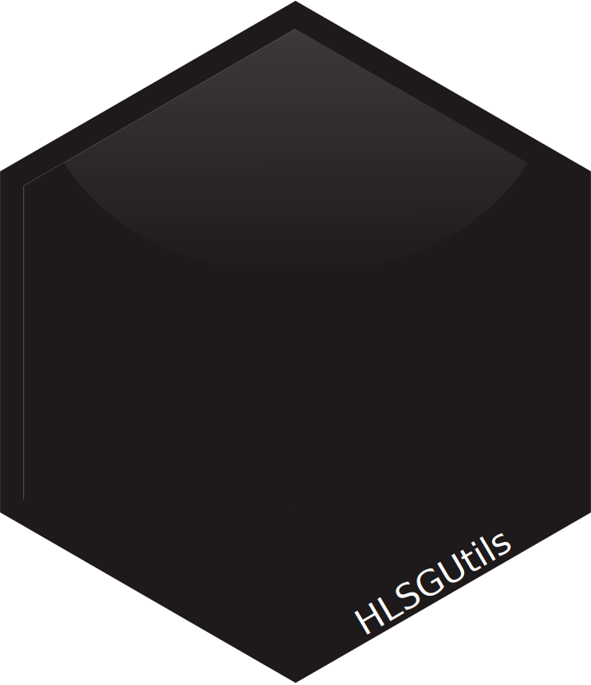

<!-- README.md is generated from README.Rmd. Please edit that file -->

<a href={https://github.com/Ehyaei/HLSGUtils}>

# HLSGUtils

[](https://github.com/Ehyaei/HLSGUtils)
[](https://lifecycle.r-lib.org/articles/stages.html#experimental)
[](https://github.com/Ehyaei/HLSGUtils/commits/main)

The goal of HLSGUtils is to collect and organise scripts that are
frequently used in our lab projects.

## Installation

To install `HLSGUtils` package, first you need to install the Python
environment package in R.

``` r
install.packages("reticulate")
```

After that we need `psutil` python package to control system resources.

``` r
library(reticulate)
py_install("psutil")
```

Now you can install the development version of `HLSGUtils` like so:

``` r
# install.packages("remotes")
remotes::install_github("Ehyaei/HLSGUtils")
```
