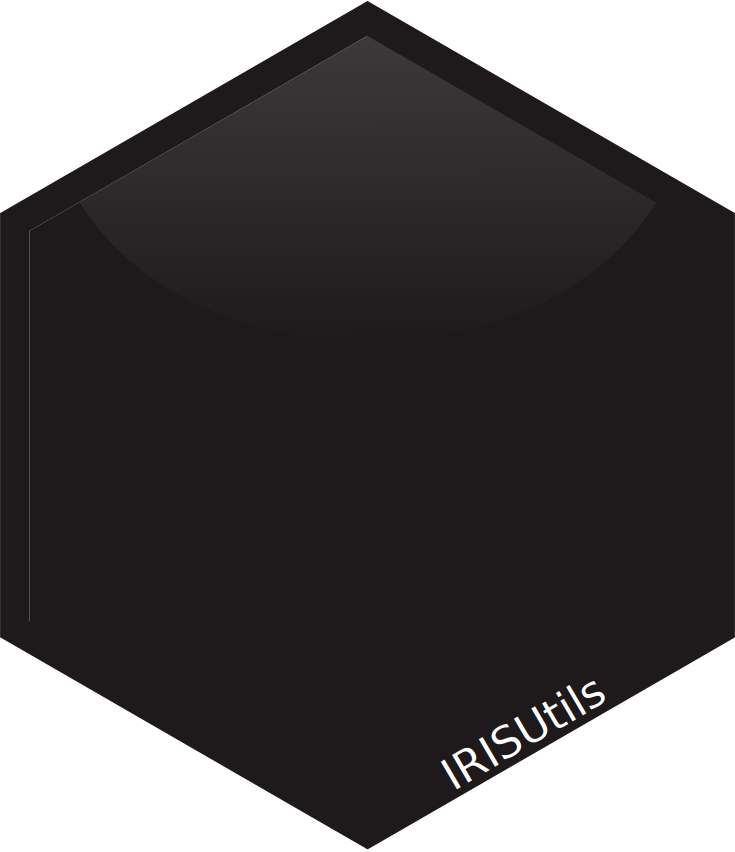

<!-- README.md is generated from README.Rmd. Please edit that file -->

<a href={https://github.com/Ehyaei/HLSGUtils}>

# IRISUtils

[](https://github.com/Ehyaei/HLSGUtils)
[](https://lifecycle.r-lib.org/articles/stages.html#experimental)
[](https://github.com/Ehyaei/HLSGUtils/commits/main)

The goal of HLSGUtils is to collect and organise scripts that are
frequently used in our lab projects.

## Installation

You can install the development version of IRISUtils like so:

``` r
# install.packages("remotes")
remotes::install_github("Ehyaei/HLSGUtils")
```
